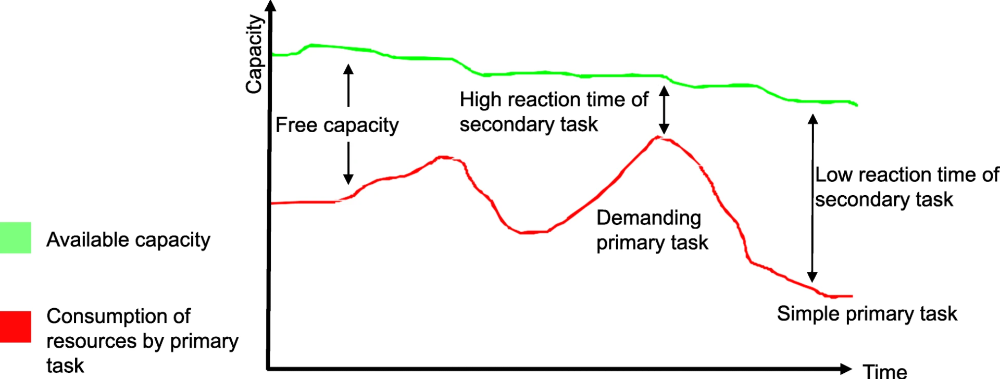
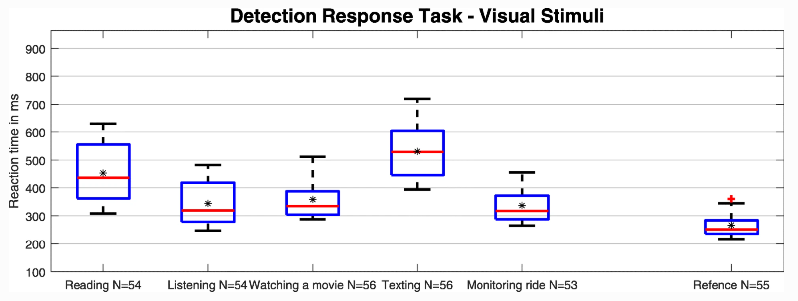
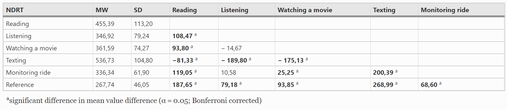

# Data-analysis-using-ANOVAS-and-t-tests
Data analysis using ANOVAS and t tests. Here I would like to test a hypothesis of a data set from one of my studies at the TU-Darmstadt by means of inference-specific tests

The starting point is a data set that I collected in a study on  automated driving. For this I measured the cognitive workload in the form of a time task. For this I built a detection-response task based on Arduino Mircocontroller (source https://github.com/InstituteOfErgonomics/drtrc). As soon as a stimulus in the form of a light signal is emitted, a test participant has to react to it in the form of a button press. The reaction time between light signal on and reaction time of the button press is quantified. The use of secondary tasks to measure spare capacity.

More detailed information can be found in my publish paper (DOI 10.1186/s12544-021-00475-5 https://etrr.springeropen.com/articles/10.1186/s12544-021-00475-5). In this study, data were recorded from 56 subjects in five different non-driving related tasks and one baseline.

I recorded the data using Silab driving simulation software, and the data were available in a separate CSV file for each subject and each test scenario. 

The data were recorded at 60Hz, so I first had to filter out every single response for each subject and activity (I also recorded two additional stiumli - auditory and tactile - which I will not consider further here. Further information can be found in my dissertation: https://tuprints.ulb.tu-darmstadt.de/11342/.

The data are prepared for each scenario. First I check if the data have outliers, these are treated by a winsorization. 

Now my hypothesis is that the mental workload differs depending on the execution of an activity. For this I use an ANOVA.

First I want to represent the present activities graphically in the form of boxplots.

Here I can already see that there are differences. However, I do not know yet which activities differ significantly. 

